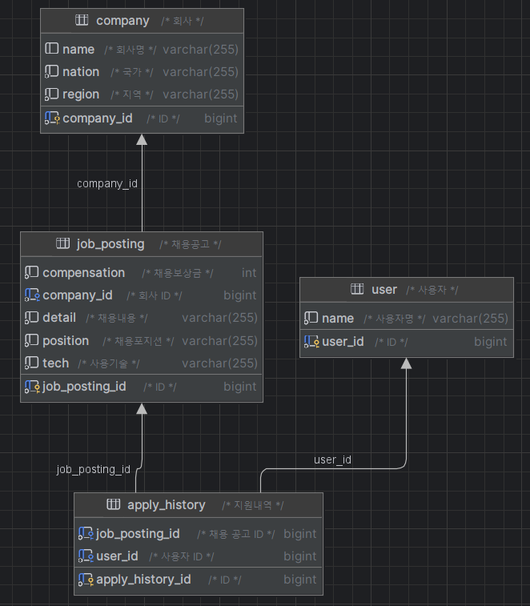

# wanted-pre-onboarding-backend
- 원티드 프리온보딩 백엔드 인턴십 선발과제

## 사용 스택
- Java 17
- Spring Boot 3.3.2
- Spring Data JPA
- QueryDsl
- MySQL 8
---
## ERD


## 요구사항 및 구현 과정

### 1. 채용공고 등록
- **채용공고 등록 전 회사 등록을 하였습니다.**
- 채용공고를 등록하기 위해서는 회사 데이터가 필요하기 때문에 회사 객체를 생성하고 데이터를 삽입하였습니다.
- 등록에 성공한 경우 : 성공 시 설정한 메세지 출력 ("success")
- 해당 회사 id가 존재하지 않는 경우 : 설정한 메세지가 출력되도록 예외처리 ("존재하지 않는 회사입니다".)

POST /job-posting
```json
{
    "companyId": 1,
    "position": "프론트엔드 주니어 개발자",
    "compensation":1000000,
    "detail":"원티드랩에서 백엔드 주니어 개발자를 채용합니다. 자격요건은..",
    "tech":"Java"
}
```

### 2. 채용공고 수정
- 회사 id 이외에 항목에 대한 내용들을 수정하도록 하였습니다.
- 수정에 성공한 경우 : 성공 시 설정한 메세지 출력 ("success")
- 채용공고 id가 존재하지 않는 경우 : 설정한 메세지가 출력되도록 예외처리 ("존재하지 않는 채용 공고입니다".)

PUT /job-posting/{jobPostingId}
```json
{
    "position": "백엔드 주니어 개발자",
    "compensation":1500000,
    "detail":"원티드랩에서 백엔드 주니어 개발자를 '적극' 채용합니다. 자격요건은..",
    "tech":"Python"
}
```

### 3. 채용공고 삭제
- DB에서 채용공고를 삭제하도록 하였습니다.
- 채용공고 id 2번의 채용공고를 삭제하였습니다.
- 삭제에 성공한 경우 : 성공 시 설정한 메세지 출력 ("success")

DELETE /job-posting/{jobPostingId}
```json
{
    "message": "success"
}
```

### 4-1. 채용공고 목록 확인
- 사용자는 채용공고 목록을 확인할 수 있습니다.
- 채용공고 Dto List<JobPostingResponse>를 가져와서 목록을 확인합니다.

GET /job-posting
```json
[
    {
        "jobPostingId": 1,
        "companyName": "회사1",
        "companyNation": "한국",
        "companyRegion": "서울",
        "position": "프론트엔드 주니어 개발자",
        "compensation": 1000000,
        "tech": "Java"
    },
    {
        "jobPostingId": 3,
        "companyName": "회사1",
        "companyNation": "한국",
        "companyRegion": "서울",
        "position": "백엔드 주니어 개발자",
        "compensation": 1500000,
        "tech": "Python"
    }
]
```

### 4-2. 채용공고 검색
- 채용공고를 키워드 통해 검색할 수 있습니다.
- 검색 조건은 회사명과 포지션으로 설정하였습니다.

GET /job-posting?search=키워드
```json
[
    {
        "jobPostingId": 3,
        "companyName": "회사1",
        "companyNation": "한국",
        "companyRegion": "서울",
        "position": "백엔드 주니어 개발자",
        "compensation": 1500000,
        "tech": "Python"
    },
    {
        "jobPostingId": 4,
        "companyName": "회사1",
        "companyNation": "한국",
        "companyRegion": "서울",
        "position": "Django 백엔드 개발자",
        "compensation": 500000,
        "tech": "Django"
    }
]
```

### 5. 채용공고 상세 페이지 확인
- 채용공고 id를 통해 채용 상세 페이지를 확인할 수 있습니다.
- 채용공고 상세페이지 Dto 추가하여 반환되도록 하였습니다.
- 채용공고 id가 존재하지 않는 경우 : 설정한 메세지가 출력되도록 예외처리 ("존재하지 않는 채용 공고입니다".)

GET /job-posting/{jobPostingId}
```json
{
    "jobPostingId": 1,
    "companyName": "회사1",
    "companyNation": "한국",
    "companyRegion": "서울",
    "position": "프론트엔드 주니어 개발자",
    "compensation": 1000000,
    "tech": "Java",
    "detail": "원티드랩에서 백엔드 주니어 개발자를 채용합니다. 자격요건은..",
    "jobPostingIdList": [
        3,
        4
    ]
}
```

### 6. 채용공고 지원
- **채용공고 지원 전 사용자 등록을 하였습니다.**
- 채용공고를 지원하기 위해서는 사용자 데이터가 필요하기 때문에 사용자 객체를 생성하고 데이터를 삽입하였습니다.
- 사용자는 채용공고 id와 사용자 id를 받아서 지원하도록 하였습니다.
- 지원에 성공한 경우 : 성공 시 설정한 메세지 출력 ("success")
- 지원한 공고에 재지원한 경우 : 설정한 메세지가 출력되도록 예외처리 ("이미 지원한 채용 공고입니다.")
- 채용공고 or 사용자가 존재하지 않는 경우 :
  설정한 메세지가 출력되도록 예외처리
  ("존재하지 않는 채용 공고입니다.", "존재하지 않는 사용자입니다.")

POST /job-posting/apply
```json
{
    "jobPostingId": 1,
    "userId":1
}
```
